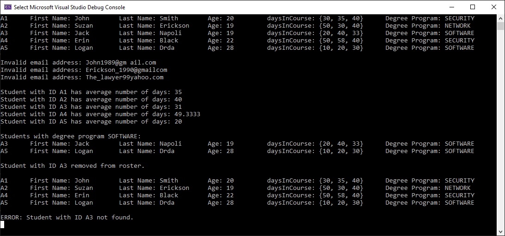
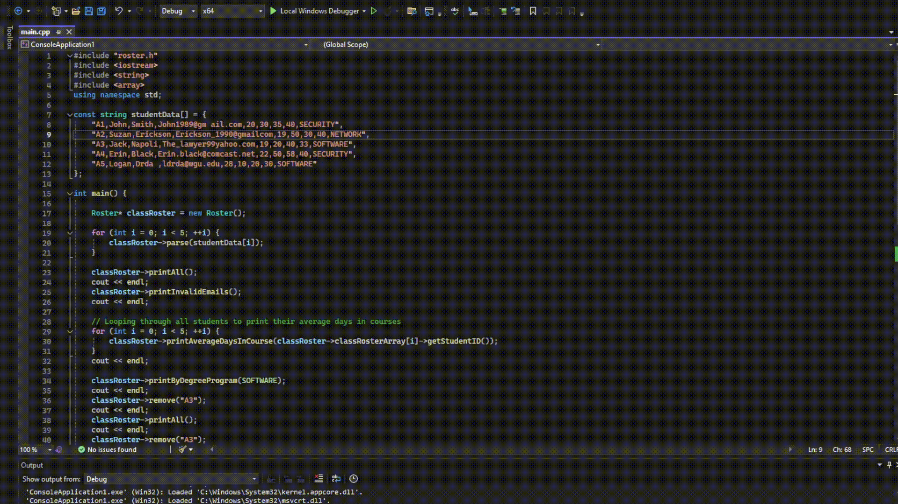

# Student Roster Management System

<!-- TABLE OF CONTENTS -->
## Table of Contents
- [About the Project](#about-the-project)
- [Features](#features)
- [Getting Started](#getting-started)
- [Demonstration](#demonstration)
- [License](#license)
- [Contact](#contact)

<!-- ABOUT THE PROJECT -->
## About The Project
This project is a C++ implementation of a simple student roster management system. The application simulates a student database for a fictional university, where each student has attributes such as name, ID, degree program, and coursework days. It is designed to showcase skills in object-oriented programming, memory management, and data processing in C++.

The program allows for:
- Adding and removing students
- Storing and retrieving student details
- Handling student course durations and validating emails
- Categorizing students by degree program

Key elements of the project include:
- **Data Management**: Using classes (`Student`, `Roster`) to organize and manage student data.
- **Memory Management**: Proper use of dynamic memory allocation with `new` and `delete` operators.
- **Input Parsing**: Parsing CSV-like data to input student information and store it efficiently.
- **Email Validation**: Checking for invalid student email addresses (simple checks for spaces, `@`, and `.`).

Student data is input programmatically as a series of comma-separated values/strings in the following format: `"A1,John,Smith,John1989@gmail.com,20,30,35,40,SECURITY"`.

This project is a console-based application that outputs student details, invalid emails, average days in course, and displays students by degree program.

<!-- FEATURES -->
## Features
Upon running the program, the student roster will be populated with a set of predefined data and operations. The user can modify `main.cpp` to perform actions such as:
- **Add Student**: Add a student with details like name, email, age, days in courses, and degree program.
- **Remove Student**: Remove a student from the roster by their ID.
- **Email Validation**: Ensures all emails conform to basic validity checks (contains `@` and `.`).
- **Display by Degree Program**: Filters students based on their degree program (SECURITY, NETWORK, SOFTWARE).
- **Average Days in Course**: Calculates the average number of days spent on each course for a student.

<!-- GETTING STARTED -->
## Getting Started
This project is written in C++ and can be compiled and run using any C++ IDE or compiler.

### Prerequisites
Make sure you have a C++ compiler installed (such as GCC or MSVC).

1. **GCC (GNU Compiler Collection)**:
    ```sh
    sudo apt install build-essential
    ```

2. **MSVC (Microsoft Visual C++)**:
    Follow instructions for Visual Studio or Visual Studio Code.

### How to Compile and Run
To compile the program, open a terminal/command prompt and use the following command:

```sh
g++ -o roster_system main.cpp roster.cpp student.cpp
./roster_system
```

<!-- Demonstration -->
## Demonstration
As `main.cpp` is prepopulated with a set of instructions, the user will see the following output upon running the program:





<!-- License -->
## License:
This project is licensed under the MIT License - see the [LICENSE](LICENSE) file for details.

<!-- CONTACT -->
## Contact
Logan Drda - logan.drda.cs@gmail.com
